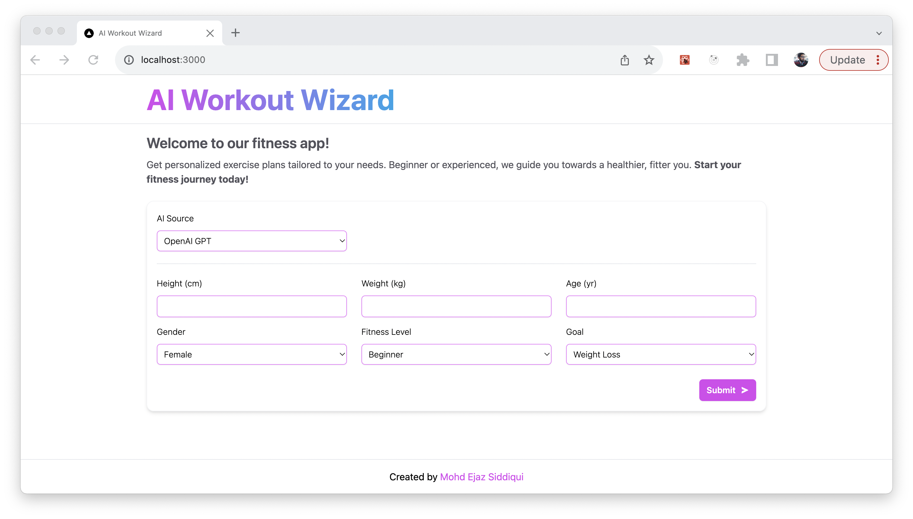

# AI Workout Planner

<p align="center">
  
</p>


The AI Workout Planner is a web application that uses artificial intelligence to generate personalized weekly workout plans for users. It leverages the power of the OpenAI GPT model and Google's PaLM API to create customized fitness routines based on user preferences and goals.

## Features

- **Personalized Workouts**: The AI Workout Planner takes into account your fitness level, goals, available equipment, and schedule to create a tailored weekly workout plan.

- **AI-Powered Recommendations**: Utilizing the OpenAI GPT model and Google's PaLM API, the app generates exercise routines that adapt to your progress and preferences.

- **Easy-to-Use Interface**: The user-friendly interface makes it simple to input your workout preferences and view your generated workout plan.

- **Progress Tracking**: Keep track of your fitness journey by logging your completed workouts and monitoring your progress over time.

## Getting Started

### Prerequisites

- Node.js and npm installed on your system
- OpenAI GPT API key (sign up for access on the OpenAI website)
- Google PaLM API key (obtain it from the Google Cloud Console)

### Installation

1. Clone the repository:

   ```bash
   git clone https://github.com/yourusername/ai-workout-planner.git


A project to generate your weekly workout plan with either OpenAI GPT model or Google PaLM API. 


## Steps to run this project

1. Clone the repo
2. Run `npm install` to install all the dependencies
3. Create a `.env.local` from `env-example` file: `cp env-example .env.local`
4. Update the OpenAI key and Google PaLM API key in the `.env.local` file
5. Run `npm run dev` to start the project


## Tech Stack

- NextJS
- TailwindCSS
- OpenAI GPT Model
- Google PaLM Model

## Contact
